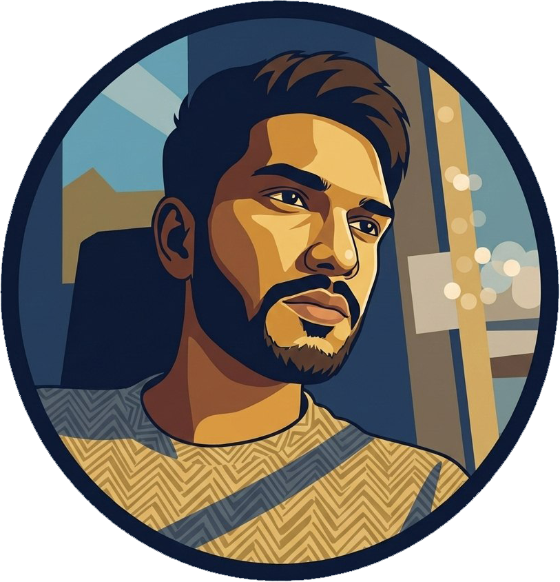

  <h1 align="center">Pamod Madubashana</h1>

  

Full-stack developer passionate about creating modern web applications with clean code and exceptional user experiences.

## 🛠️ Skills

- **Frontend**: React, TypeScript, Next.js, Tailwind CSS, Framer Motion
- **Backend**: Node.js, Express, MongoDB, PostgreSQL
- **Tools**: Git, Docker, AWS, Vercel, GitHub Actions
- **Languages**: JavaScript, TypeScript, Python, Go

## 📫 Contact

- **Email**: [contact@pamod.is-a.dev](mailto:contact@pamod.is-a.dev)
- **GitHub**: [pamod-madubashana](https://github.com/pamod-madubashana)
- **LinkedIn**: [pamod-madubashana](https://www.linkedin.com/in/pamod-madubashana-886b621a2)
- **Website**: [pamod.is-a.dev](https://pamod.is-a.dev)

## 🌟 Projects

Check out my latest work on [pamod.is-a.dev/projects](https://pamod.is-a.dev/projects)

## 💻 Source Code

View the source code for this website on [GitHub](https://github.com/pamod-madubashana/MySite)

